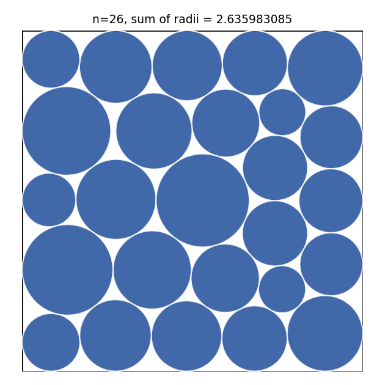
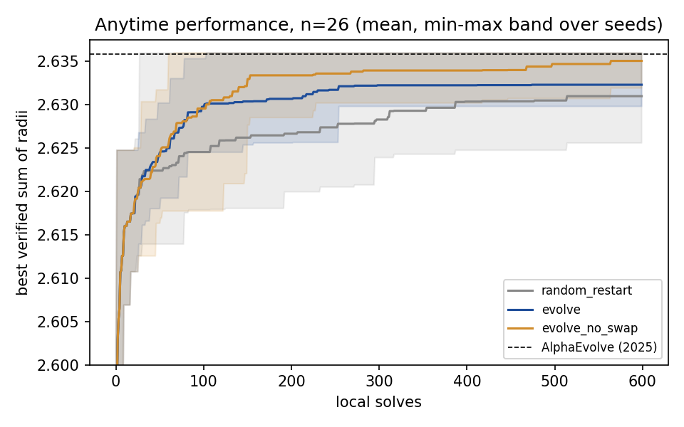

# trusted-evolve

**Evolutionary search with a trusted evaluator, run on the circle-packing problem from DeepMind's AlphaEvolve paper. It includes a multi-seed study of how often single-run comparisons mislead an automated research loop.**

<p align="center"></p>

```bash
pip install -e ".[dev]"
python verify_solution.py results/best_n26.json    # independent zero-tolerance check of the best packing
python -m tevolve.study --seeds 10 --budget 600    # full study, ~2 min on 12 CPU cores
pytest -q
```

---

## The problem

Place **26 non-overlapping circles inside the unit square to maximise the sum of their radii.** It's a hard non-convex problem with many local optima, and a public benchmark for AI-driven discovery systems:

| Result | Sum of radii (n = 26) |
|---|---|
| Previous record (Friedman, 2012) | 2.634 |
| AlphaEvolve (Novikov et al., 2025) | 2.63586276 |
| Best known (Packomania list; matched by ShinkaEvolve, 2025) | 2.635983084918 |
| **This repo** (zero-tolerance verifier) | **2.635983084918** |

The packing in [`results/best_n26.json`](results/best_n26.json) **beats AlphaEvolve's published value and equals the best known value. It is not a new record.** It was found in ~1 minute on a laptop CPU, with no LLM in the loop.

## Why "trusted"

Search systems are only as good as their evaluator. Published packings for this problem have been checked with different tolerances: some pipelines accept overlaps up to 1e-7, which can inflate scores. Here:

- **`verify()` has zero tolerance.** A circle that crosses a wall or overlaps a neighbour by 1e-15 is invalid and scores 0 (see `tests/test_verifier_has_zero_tolerance`).
- The optimiser's output always goes through **`repair()`**, which shrinks radii until the strict check passes. The search never earns credit for an *almost*-valid packing.
- **[`verify_solution.py`](verify_solution.py) is a standalone checker** (numpy only, independent of the search code) that anyone can run on the saved solution.

## Method

- **Local solver:** SLSQP on `max Σ r_i` subject to containment and pairwise non-overlap, with **analytic constraint Jacobians** (checked against finite differences in the tests). One solve takes ~0.1–0.2 s.
- **`random_restart`** (the strong classical baseline): independent random starts, each locally optimised.
- **`evolve`**: an elite population. A parent is mutated by an operator (`relocate_small` moves the 1–3 smallest circles, `jitter` adds Gaussian noise to every centre, `swap` exchanges two circles), re-optimised, verified, and kept only if it scores well.
- **Equal budget:** every run gets the same number of local solves (600) and is deterministic per seed.

## Results: 30 runs (3 strategies × 10 seeds)



| Strategy | Mean best | 95% CI (bootstrap) | Runs > AlphaEvolve | Runs at best known (±1e-6) |
|---|---|---|---|---|
| `random_restart` | 2.631002 | [2.629298, 2.632681] | 1/10 | 1/10 |
| `evolve` (all 3 operators) | 2.632320 | [2.631157, 2.633656] | 2/10 | 2/10 |
| `evolve_no_swap` | **2.635071** | [2.634196, 2.635814] | **6/10** | **6/10** |

| Comparison | Δ mean | Welch p | Wrong call with 1 seed | 3 seeds | 5 seeds |
|---|---|---|---|---|---|
| `evolve` vs `random_restart` | +0.00132 | 0.26 | **30%** | 24% | 13% |
| `evolve` vs `evolve_no_swap` | −0.00275 | **0.004** | 18% | 2% | 0% |

*"Wrong call with k seeds"* is the share of k-seed subsets where comparing means picks the opposite winner from the full 10-seed comparison. Full data: [`results/summary.json`](results/summary.json), per-run curves: [`results/runs.jsonl`](results/runs.jsonl).

**What I learned**
1. **An ablation found a harmful component.** Removing the `swap` operator raised the hit rate on the best-known packing from 2/10 to 6/10 seeds (p = 0.004). Swapping two circles of different sizes almost always lands in a much worse basin, so it wastes budget.
2. **The "obvious" result isn't significant.** Evolution beats random restarts on average, but at 10 seeds the difference is not significant (p = 0.26), and a single-seed comparison picks the wrong winner **30%** of the time. An automated research loop that accepts changes from single runs would act on noise roughly a third of the time.
3. **Strong classical baselines matter.** A plain random-restart local solver reached the best known value once in 10 runs. Any claim that an AI system "discovered" a result on this problem should be compared against that baseline.

## The research loop (`tevolve/loop.py`)

Lesson 2 is turned into a mechanism:

```
proposer (Claude or random)  ──►  config + one-sentence hypothesis
            ▲                                  │
            │                                  ▼
        ledger  ◄──  accept only if mean ↑ AND Welch p < 0.05  ◄──  run on fixed seeds
```

- **`ClaudeProposer`** reads the full ledger (every hypothesis, config, mean and decision, including rejections). It returns its next experiment as **schema-constrained JSON** (structured outputs, default model `claude-opus-5-5`).
- **The model only proposes.** `validate()` bounds-checks the proposal in code, and the **statistical gate decides**. A proposal cannot be "accepted" by sounding convincing.
- **`RandomProposer`** is the baseline. It uses the same gate and budget.

```bash
python -m tevolve.loop --proposer random --rounds 4 --seeds 5 --budget 300
python -m tevolve.loop --proposer claude --rounds 6        # needs ANTHROPIC_API_KEY
```

*Status:* the loop and the Claude proposer are unit-tested (the Claude test uses a scripted client). Claude-vs-random loop results are not reported yet. They will be added with several loop seeds once measured.

## Repository

| Path | Contents |
|---|---|
| `tevolve/problems/circle_packing.py` | Problem, zero-tolerance verifier, repair, SLSQP with analytic Jacobians, mutation operators |
| `tevolve/search.py` | `random_restart`, `evolve` (deterministic per seed, equal budget, anytime curves) |
| `tevolve/stats.py` | Bootstrap CIs, Welch / Mann-Whitney tests, k-seed decision error |
| `tevolve/study.py` | Parallel multi-seed study → `results/` (summary, figures, best solution) |
| `tevolve/loop.py` | Propose → run → gate → ledger research loop (random / Claude proposers) |
| `verify_solution.py` | Independent checker for saved solutions |

## Limitations

- **One problem size (n = 26), one budget.** The operator finding may not transfer to other n or larger budgets.
- **10 seeds per strategy.** The CIs are wide enough that `evolve` vs `random_restart` stays unresolved, which is the point of the study but also its limit.
- **Wall-clock times** were measured with 12 runs in parallel, so per-run times are inflated by CPU contention.

## References

- Novikov et al., *AlphaEvolve: A coding agent for scientific and algorithmic discovery*, Google DeepMind, 2025
- Lange et al., *ShinkaEvolve: Towards Open-Ended and Sample-Efficient Program Evolution*, 2025 ([arXiv:2509.19349](https://arxiv.org/abs/2509.19349))
- E. Specht, Packomania: [circles in a square, maximised sum of radii](https://packomania.com/csqv/csqv.html)

## License

MIT
